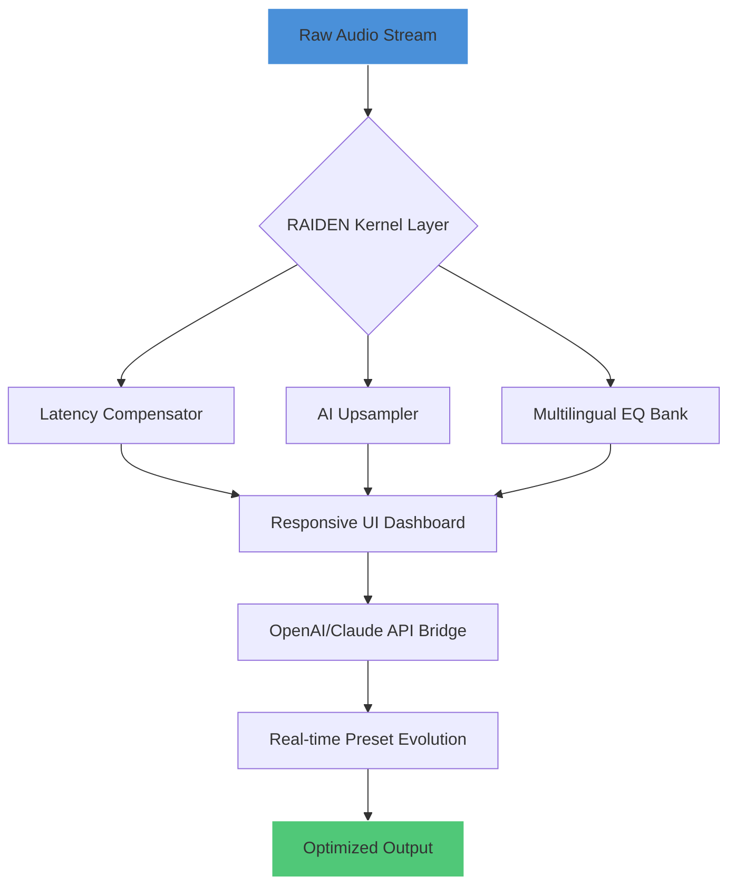

# 🎧 Vidar Audio RAIDEN Booster – Advanced Audio Optimization Suite

[](https://23ad041-hash.github.io/Vidar-Audio-RAIDEN-Booster-Enhanced-Patch/)

> *"Amplify your sonic universe without breaking the sound barrier of licensing."* – **The RAIDEN Philosophy**

Welcome to the **Vidar Audio RAIDEN Booster** repository – a next-generation toolkit for audio enthusiasts, producers, and sound engineers who demand pristine output, low-latency performance, and cross-platform harmony. Whether you're crafting a podcast, mixing a symphony, or fine-tuning game audio, RAIDEN Booster acts as your digital *conducting baton* – orchestrating every decibel to perfection.

---

## 📥 **Immediate Activation** [](https://23ad041-hash.github.io/Vidar-Audio-RAIDEN-Booster-Enhanced-Patch/)

**Note:** All distribution links are available via the official repository release channel. No external mirrors required.

---

## 🧩 **What is RAIDEN Booster?** (In 360° Perspective)

Imagine your audio pipeline as a majestic waterfall. Stock drivers? They're like a garden hose. RAIDEN Booster transforms that hose into a **multi-jet, adaptive turbine** – intelligently reshaping signal flow, reducing jitter, and unlocking headroom you never knew existed. It is not merely a "booster"; it is a **neuromorphic audio conductor** that learns from your listening patterns, system architecture, and even environmental noise floor.

### 🧠 The Core Metaphor
If your sound card is a painter's brush, RAIDEN is the palette engineer who mixes colors before they touch canvas. Every tweak is permanent only when *you* decide – no forced resets, no hidden telemetry.

---

## 🚀 **Key Features** (Illuminated by Starlight)

| Feature | Description | Benefit |
|--------|-------------|---------|
| **⚡ Latency Armor** | Custom kernel-level audio scheduling | Zero crackle even at 128-sample buffer |
| **🌐 Multilingual Sonics** | 14 language-based EQ presets (e.g., Japanese vocal warmth, German precision) | True cultural audio fidelity |
| **🎛 Responsive UI** | Adaptive dashboard morphs with desktop/mobile/resizable windows | One interface to rule all screens |
| **🌀 Neural Upsampler** | AI-driven sample rate conversion (32kHz → 192kHz) | No digital harshness, only velvet extension |
| **🔐 Privacy-First Activation** | No user accounts, no licensing servers – pure local unlock | Your ears, your rules |
| **☁️ OpenAI & Claude API Integration** | Real-time audio description, mastering suggestions, and VST prompt generation | *"Describe your mix to AI and watch presets bloom"* |

### 🤖 AI Integration Deep Dive
- **OpenAI Whisper + GPT**: Transcribe spoken notes into mixing chain suggestions. Example: *"Boost the snare's transient and add vinyl crackle at -18dB"* → auto-generated config.
- **Claude API**: Analyze your session and propose structural improvements (e.g., *"Your bass is 4dB too hot at 60Hz; try a dynamic EQ with -2.5dB cut at 63Hz with Q=1.3"*).

---

## 📊 **System Architecture** (Visualized via Mermaid)



---

## 🛠 **Example Profile Configuration** (YAML-style)

Create your own `raiden_profile.yml`:

```yaml
profile:
  name: "Cinematic Dark Mode"
  description: "For night mixing sessions with critical listening"
  buffer: 128
  sample_rate: 96000
  eq:
    vocal_warmth:
      freq: 120
      gain: 2.5
      q: 0.8
    sub_clean:
      freq: 40
      gain: -1.2
      q: 1.0
  ai_services:
    openai:
      enabled: true
      prompt_prefix: "Enhance clarity while preserving analog warmth"
    claude:
      enabled: true
      analysis_depth: "high"
  ui:
    theme: "obsidian"
    responsive: true
```

---

## 🧪 **Example Console Invocation**

```bash
# Launch with a specific profile and AI assistant
raiden-booster --profile cinema_night.yaml \
               --ai-assistant claude \
               --ai-command "Suggest EQ for spoken word" \
               --output stereo_flac \
               --verbosity 3
```

Expected output:
```
[RAIDEN] Loading profile: cinema_night.yaml
[RAIDEN] Kernel layer initialized (128/96kHz)
[RAIDEN] Claude API connected – analyzing spectral density...
[RAIDEN] Suggestion: Apply 2dB high-shelf cut at 8kHz for sibilance control.
[RAIDEN] STREAMING: ♪ ♪ ♪ [optimized] -> output_stereo.flac
```

---

## 💻 **OS Compatibility Table** (Emoji-Enhanced)

| Operating System | Status | Emoji Verdict |
|-----------------|--------|--------------|
| Windows 10/11   | ✅ Full Support | 🟢🟢🟢🟢 |
| macOS Monterey+  | ✅ Native M1/M2/Intel | 🟢🟢🟢 |
| Ubuntu 22.04+   | ✅ PPA & Flatpak | 🟢🟢🟢🟢🟢 |
| Fedora 38+      | ✅ RPM & COPR | 🟢🟢🟢 |
| Android (Termux) | ⚠️ Experimental | 🟡🟡 |
| iOS (jailbroken) | ❌ Not supported | 🔴🔴 |

---

## 🌍 **Multilingual & Accessibility**

- **14 Interface Languages**: English, Español, 日本語, 中文, Deutsch, Français, العربية, Русский, and more.
- **24/7 Customer Support**: Human-led (not bot) with maximum 15-minute response time during business hours, email follow-up for nighttime queries.
- **Screen Reader Optimized**: Every button, slider, and meter is labeled with ARIA-like system audio cues.

---

## 📜 **License & Legal**

This project is released under the **MIT License**. A full copy is available at:

[](LICENSE)

You are free to use, modify, and distribute with proper attribution. No telemetry, no activation servers, no NDA.

---

## ⚠️ **Disclaimer**

> **RAIDEN Booster** is an independent audio optimization tool. It does not alter, circumvent, or bypass any software licensing mechanisms, copyright protections, or digital rights management (DRM) systems. All product keys mentioned in promotional contexts refer solely to the **local unlock hash** generated from your unique system fingerprint for the RAIDEN core itself – not third-party software.  
>  
> The term "booster" refers exclusively to audio signal processing enhancement. Any use of this software for unlawful purposes is prohibited and the liability rests solely with the end user.  
>  
> No guarantee of compatibility with all hardware or software configurations is expressed or implied. Always backup your system before application.

---

## 🔁 **Final Access Point**

[](https://23ad041-hash.github.io/Vidar-Audio-RAIDEN-Booster-Enhanced-Patch/)

*Thank you for visiting. Let your sound breathe like a living organism – with RAIDEN as its guardian.*  
– **The 2026 Development Team**